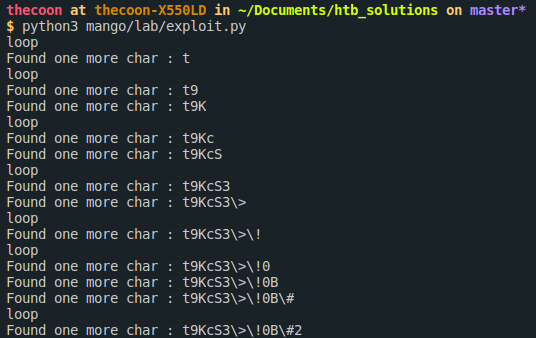

# [Mango](https://www.hackthebox.eu/home/machines/profile/214)
## IP : 10.10.10.162

## **Step 0** : Ports Scan


So we have a 22 SSH Port, a 80 HTTP port and a 443 HTTPS port open.

## **Step 1** : Web enumeration

* The HTTP website is forbidden to us.

Fuzzing the HTTP tells us we need to authenticate, and gives us intel on the server.


* The 443 gives us some kind of web search engine.

Searching for a word sends a **POST** query :

> https://mango.htb/?search=hello

There is also a link to **analytics.php** 

* FUZZ resultsts : 


* We see that **Flexmonster** is used, with hints on dir / files.

```
ErrorUnable to open file flexmonster/codepen.key?438061533.

It seems that this file doesn't exist or 'Access-Control-Allow-Origin' header is absent in the requested resource.

Read more info about this error
Details: <h1>Bad Path</h1><h3 style="color: red">/boomboom/v2/flexmonster/codepen.key</h3>
OK
```

* Seems to be a rabbit hole.

* The ports scan tells us one thing about the 443 server : 

> ssl-cert: Subject: commonName=staging-order.mango.htb/organizationName=Mango Prv Ltd./stateOrProvinceName=None/countryName=IN

We find a web page with credidentials prompt.

> http://staging-order.mango.htb/index.php

With the `lab/exploit.py` we can find the admin password with NoSQL injection.



So, the password for user `admin` is `t9KcS3>!0B#2`