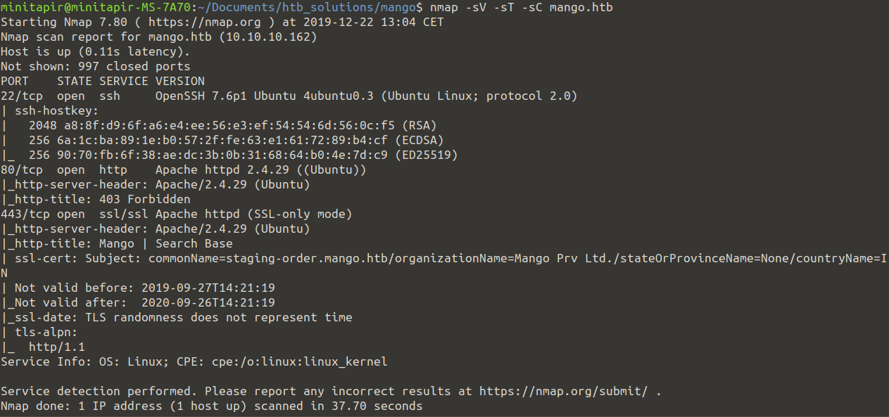
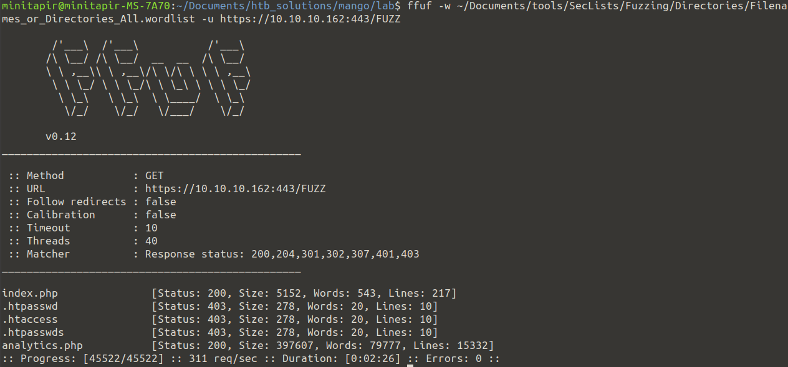

# [Mango](https://www.hackthebox.eu/home/machines/profile/214)
## IP : 10.10.10.162

## **Step 0** : Ports Scan

So we have a 22 SSH Port, a 80 HTTP port and a 443 HTTPS port open.

## **Step 1** : Web enumeration

* The HTTP website is forbidden to us.

Fuzzing the HTTP tells us we need to authenticate, and gives us intel on the server.

* The 443 gives us some kind of web search engine.

Searching for a word sends a **POST** query :

> https://mango.htb/?search=hello

There is also a link to **analytics.php** 

* FUZZ resultsts : 

