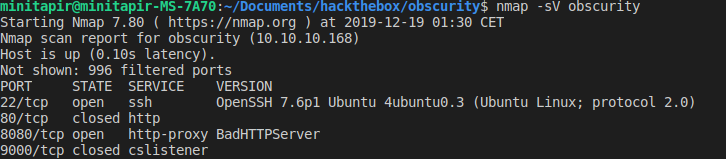
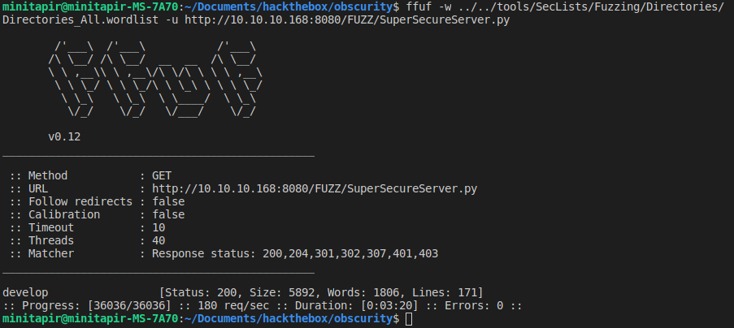

# [Obscurity](https://www.hackthebox.eu/home/machines/profile/219)
## IP : 10.10.10.168

## **Step 0** : Ports Scan



Website : http://10.10.10.168:8080/

## __Step 1__ : Hints from the [home page](http://10.10.10.168:8080/).

> Message to server devs: the current source code for the web server is in __SuperSecureServer.py__ in the secret development directory`

After some tests the server is fuzzable from the root. Any file or folder can be returned by the browser.



## __Step 2__ : Understanding the custom made server

From *hints/SuperSecureServer.py* :
```python
def serveDoc(self, path, docRoot):
    ...
    path = urllib.parse.unquote(path)
    ...
    exec(info.format(path)) # This is how you do string formatting, right?
    ...
```
The `path` parameter coming from the URL. So it's possible to inject python code from url. We need to encode with `urllib.quote()` the code to send it to the http server:

> http:/obscurity/{urlib_quoted_python_code}